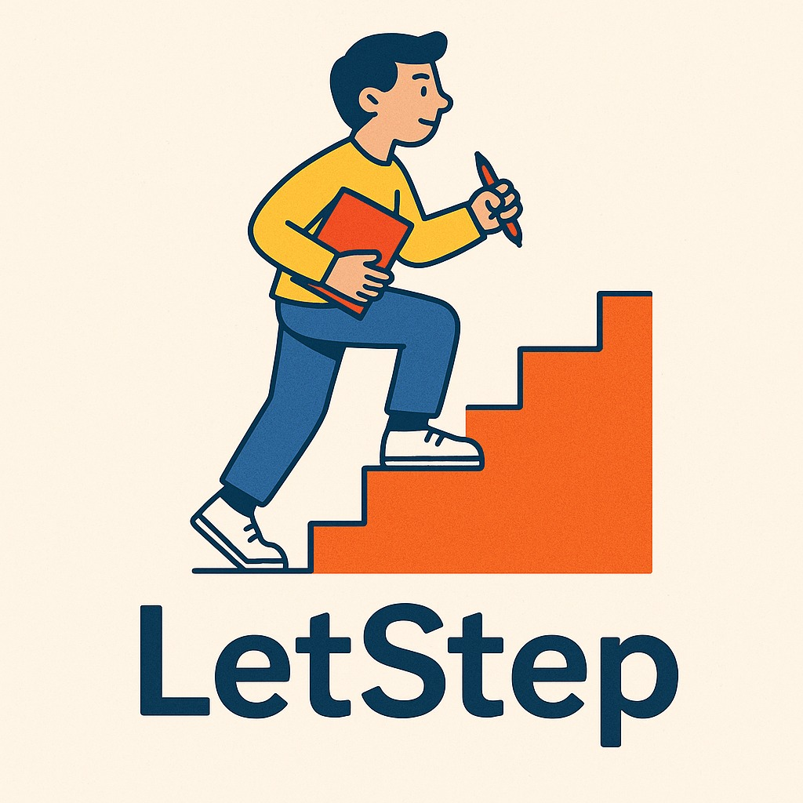

 <html>
  <body>

  

  # **Team & Product Name**

  ### **`LetStep`**

  # Information About Team and Product

  ## Team Members

  <table>
    <tr>
      <th></th>
      <th>Name</th>
      <th>Title</th>
      <th>Socials</th>
    </tr>
    <tr>
      <td></td>
      <td>Büşra Cankit</td>
      <td>Scrum Master</td>
      <td>
        
        
      </td>
    </tr>
    <tr>
      <td></td>
      <td>Furkan Caniş</td>
      <td>Product Owner</td>
      <td>
        
        
      </td>
    </tr>
    <tr>
      <td></td>
      <td>Alina Arıcı</td>
      <td>Developer</td>
      <td>
        
        
      </td>
    </tr>
    <tr>
      <td></td>
      <td>Elif Bilge Göl</td>
      <td>Developer</td>
      <td>
        
        
      </td>
    </tr>
    <tr>
      <td></td>
      <td>Kemal Baz </td>
      <td>Developer</td>
      <td>
        
        
      </td>
    </tr>
    <tr>
  </tr>
  </table>

  ## Product Description
Empowering Every Mind to Learn with Confidence.

Our product is a learning support platform specifically designed for individuals with dyslexia. It aims to make the learning journey easier, more accessible, and more enjoyable for students who face reading and writing challenges.

Whether a child is struggling to read fluently or a teenager needs better tools to organize their thoughts, our app provides personalized educational experiences to help them succeed in the classroom and beyond.

What does it offer?

    ✅ Interactive lessons using visual, auditory, and kinesthetic techniques

    ✅ Text-to-speech and speech-to-text support

    ✅ Adaptive reading modes (font, spacing, color filters)

    ✅ Gamified learning modules to keep motivation high

    ✅ Progress tracking for parents and teachers

    ✅ Exercises focused on building confidence, comprehension, and memory

We believe that dyslexia is not a limitation, but a different way of thinking. Our mission is to give every learner the tools they need to thrive, regardless of how they read or write.

  

    
<h2>Product Features</h2>

  <h3>Item Rental:</h3>
    
zaten allows users to rent out their belongings to others. Users can easily initiate the rental process, share item details, and rent out their items to others for a suitable fee.

  <h2>Vehicle Rental:</h2>
    
zaten enables users to rent vehicles. Vehicle owners can rent out their unused vehicles to other users via the zaten platform, earning additional income. Renters can find and rent a suitable vehicle to meet their needs.

  <h2>Secure Payment System:</h2>
    
zaten provides a secure payment system for users to make payments. Rental fees are processed through secure payment transactions conducted on the platform.

  <h2>Rating and Review System:</h2>
    
zaten allows users to rate and review each other. This feature enables users to assess the reliability and satisfaction levels of other users and make informed choices.

  <h2>Reservation Management:</h2>
    
zaten offers users reservation management capabilities. Users can make reservations for items or vehicles for their desired date range and specify the duration of usage.

  <h2>User-to-User Communication:</h2>
    
zaten facilitates communication between users for discussing rental details. Users can directly communicate with item or vehicle owners, ask questions, negotiate prices, arrange delivery, and discuss other details. The chat feature provides a safer and more personalized communication experience, streamlining the rental process.

  <h2>User Support:</h2>
    
zaten provides customer support services to users. Users can contact customer service when they have any issues or questions related to the platform and receive assistance.

  <h2>Categorization and Search:</h2>
    
zaten allows users to categorize and search for items or vehicles. Users can filter based on desired categories or specific features, making it easy to find the item or vehicle they are looking for.

  <h2>Favorites:</h2>
    
The Favorites feature serves as a personal catalog, allowing you to save and organize items or vehicles that have caught your interest. This curated list helps in quick decision-making, allowing you to rent an item whenever you're ready.

  <h2>Making an Offer:</h2>
    
As a prospective renter, you can propose an offer on any product or vehicle you wish to rent. Simply go to the product page, click on 'Make an Offer,' and enter your desired price and date range. Once you submit your offer, it will be sent directly to the product owner for consideration.

  <h2>Receiving and Managing Offers:</h2>
    
As a product owner, you can view all incoming offers on your personal 'Offers' page. Here, you'll see a list of all offers made on your items or vehicles, each with details including the proposed price, the desired rental period, and the prospective renter's information. You can review each offer and decide whether to accept, decline, or negotiate the terms. This feature gives you full control over your rental prices and schedules, allowing you to rent out your belongings or vehicles on your own terms.

  <h2>Our Sponsors' Customizable Profile:</h2>
    
Our goal at zaten is to provide our sponsors with the opportunity to display their products on our platform, thereby encouraging users to rent or purchase them. Through our customizable Sponsor Profile pages that reflect our sponsors' unique brand identities, users can discover and safely rent or purchase the valuable products and services offered by our sponsors.

  <h2>Nearby Products:</h2>
    
When using zaten, our location feature allows users to view products that are nearby. This ensures that potential optimal choices are surfaced based on their locality, offering a more convenient and efficient way for users to discover and rent items. The location feature streamlines the rental process, making it easier for users to find and rent the best products within their immediate vicinity.

  <h2>Multi-language Support:</h2>
    
zaten also features multi-language support, ensuring that our platform is accessible and user-friendly to people from diverse linguistic backgrounds. This feature allows users to navigate the platform, browse items, and communicate with other users in their preferred language. By offering multi-language support, we aim to break down language barriers and foster a more inclusive and global community on zaten.

  

  

    
<h2>Target Audience</h2>

    
zaten's target audience primarily consists of Millennials and Gen Z who value access over ownership and are open to sharing resources. These younger generations are interested in renting various items such as electronics, fashion accessories, sports equipment, and tools. Urban dwellers, especially those in smaller apartments or shared living spaces, who have limited storage, prefer renting items like camping gear, home appliances, and furniture. Travelers and tourists with specific needs during their trips, as well as event planners requiring temporary access to equipment, are also potential users of zaten's app. Additionally, sustainable consumers who care about the environment and reducing waste can be attracted by emphasizing the role of sharing resources in achieving sustainability goals.

  

  --- 

  

  

    
<h1>Sprint 1</h1>

  

    
<h3>Sprint 1 - App Screenshots</h3>

  <table style="width: 100%;">
    <tr>
      <td colspan="4" style="text-align: center;"><h2>Authentication pages</h2></td>
    </tr>
    <tr>
      <td style="width: 25%;"></td>
      <td style="width: 25%;"></td>
      <td style="width: 25%;"></td>
    </tr>
    <tr>
      <td colspan="4" style="text-align: center;"><h2>Homepage and Location pages</h2></td>
    </tr>
    <tr>
      <td style="width: 25%;"></td>
      <td style="width: 25%;"></td>
      <td style="width: 25%;"></td>
    </tr>
    <tr>
      <td colspan="4" style="text-align: center;"><h2>Add Product pages</h2></td>
    </tr>
    <tr>
      <td style="width: 25%;"></td>
      <td style="width: 25%;"></td>
      <td style="width: 25%;"></td>
      <td style="width: 25%;"></td>
    </tr>
    <tr>
      <td colspan="4" style="text-align: center;"><h2>Offers pages</h2></td>
    </tr>
    <tr>
      <td style="width: 25%;"></td>
      <td style="width: 25%;"></td>
      <td style="width: 25%;"></td>
      <td style="width: 25%;"></td>
    </tr>
    <tr>
      <td colspan="4" style="text-align: center;"><h2>Profile and Settings pages</h2></td>
    </tr>
    <tr>
      <td style="width: 25%;"></td>
      <td style="width: 25%;"></td>
      <td style="width: 25%;"></td>
      <td style="width: 25%;"></td>
    </tr>
    <tr>
      <td colspan="4" style="text-align: center;"><h2>Rent Product pages</h2></td>
    </tr>
    <tr>
      <td style="width: 25%;"></td>
      <td style="width: 25%;"></td>
      <td style="width: 25%;"></td>
    </tr>
  </table>
  
   

  

    
<h3>Sprint 1 - Sprint Board Update Screenshots</h3>

    
    
    
    
    
    
  

  

    
<h3>Sprint 1 - Burndown Chart</h3>

    
    
  

  - **Sprint Notes**:
    - It has been decided to use `Trello` for project management.

    - It has been decided to use `Figma` for UI designs.

    - It has been decided to use `Riverpod` for state management.

    - The `MVVM` structure has been set up and it will be proceeded on this basis.

    - It has been decided to use `Firebase` for the backend, and the `GetX` system for the page routing system.

    - It was decided to use `email login` for the login system.

    - It was decided to perform `identity verification` following the login system.

    - It has been decided to use `Hive` as the local database.
  - **Expected point completion within Sprint**: 200 points
  - **Point Completion Logic**: `(205 points completed)` The first sprint has a target of 200 points, the second sprint 100 points, and the third sprint 200 points. A lower point target has been set for the second sprint since there is a national holiday in Turkey during this period and all team members are residing in Turkey.
  - **Daily Scrum**: See file
  - **Product Backlog URL:** Click for Backlog (Trello)
  - **Sprint Review:**
    - Arda and Burak carried out a coordinated effort for the backend and frontend. We have agreed within the team to continue this way in the next sprint.

    - We struggled to decide on an application name for a while. We transitioned from 'zaten' to 'zaten' and took another step towards branding by purchasing the 'zaten.app' domain for the name.

    - The two biggest problems we encountered in this sprint were difficulty in deciding on a color palette and not having completed the logo yet.

    - We learned that the FloatingActionButton usage in the BottomNavigationBar and the notched feature of the navigation bar have been removed in Material 3, we overcame this issue by designing it ourselves.

    - Overall, we believe we had a good sprint process. We experienced a sprint process close to what we planned.

  - **Sprint Review Participants:** `Burak Taha Cevheroğlu`, `Arda Demirel`, `Dila Hazal Bilgin`, `Merve Ağaçayak`, `Onur Konuk`
  - **Sprint Retrospective:**
    - In the second sprint, it was decided in the team meeting that only Arda and Burak would write code for mobile.

    - In the second sprint, we decided to write our own API (for location information).

    - We had to postpone the logo design to the second sprint. We will continue with the design.

    - We will continue to develop the local database system (Hive).

    - As Burak and Arda will continue more with software related tasks, much of the project management has been delegated to the remaining team members.

    - In the second sprint, we will start writing a website for the zaten.app domain we bought for brand recognition. This task has been handed over to Onur.

    - It was decided to establish a review system before the product goes live during the second sprint.

    - For brand recognition and marketing purposes, it was decided to open an Instagram account during the second sprint.

    - In addition to email authentication, it was decided to add the Google auth system in the second sprint.

    - It was decided to add test AdMobs in the second sprint.

    - We decided to start localization and the first languages will be English and Turkish.

    - It was decided to add a user-to-user SDK with the Stream Chat SDK in the second sprint.

  - **Other Notes**:
  

    
<h3>Additional Files</h3>

    <ul>
      <li><strong>Project Scope And Goals:</strong> <a href="./bootcampFiles/sprintOne/projectscopeandgoals.pdf">See file</a></li>
      <li><strong>Target Audience:</strong> <a href="./bootcampFiles/sprintOne/targetaudience.pdf">See file</a></li>
      <li><strong>Conversations:</strong> See file</li>
    </ul>
  

  

