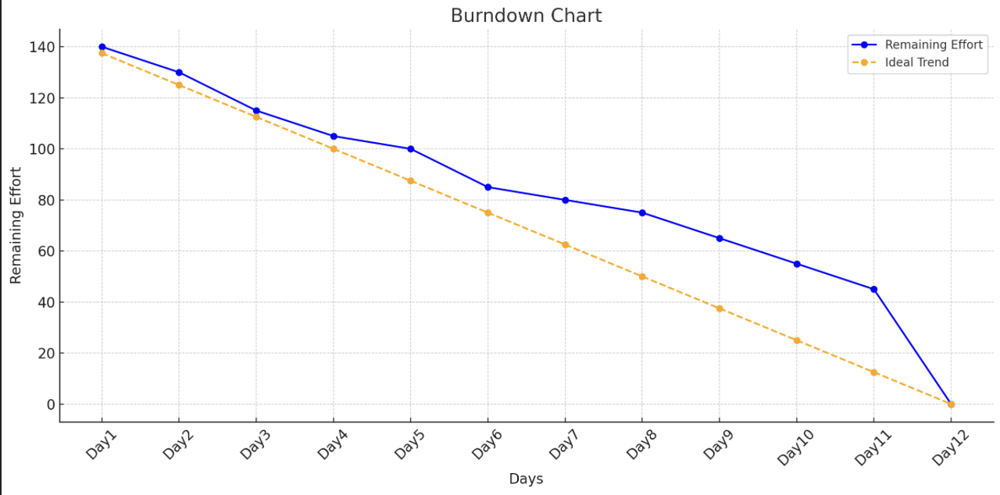

 <html>
  <body>

  

  # **Team & Product Name**

  ### **`LetStep`**

  # Information About Team and Product

  ## Team Members

  <table>
    <tr>
      <th></th>
      <th>Name</th>
      <th>Title</th>
      <th>Socials</th>
    </tr>
    <tr>
      <td></td>
      <td>Büşra Cankit</td>
      <td>Scrum Master</td>
      <td>
        
        
      </td>
    </tr>
    <tr>
      <td></td>
      <td>Furkan Caniş</td>
      <td>Product Owner</td>
      <td>
        
        
      </td>
    </tr>
    <tr>
      <td></td>
      <td>Alina Arıcı</td>
      <td>Developer</td>
      <td>
        
        
      </td>
    </tr>
    <tr>
      <td></td>
      <td>Elif Bilge Göl</td>
      <td>Developer</td>
      <td>
        
        
      </td>
    </tr>
    <tr>
      <td></td>
      <td>Kemal Baz </td>
      <td>Developer</td>
      <td>
        
        
      </td>
    </tr>
    <tr>
  </tr>
  </table>

  

<h2>Product Description</h2>

LetStep is an AI-powered, web-based educational platform designed to support individuals diagnosed with dyslexia in developing their reading, comprehension, and learning skills. It makes learning more accessible and sustainable through personalized exercises tailored to each individual's cognitive profile.

The platform analyzes users' needs based on their age, learning level, and pace, evaluating data such as reading habits and attention patterns to deliver customized content. With the support of artificial intelligence and data science, the difficulty level of the exercises is dynamically adjusted.

LetStep's clean and focus-friendly interface helps users with dyslexia stay engaged with the content. The built-in text-to-speech and feedback systems support auditory learning, transforming the platform into a digital learning coach.

Additionally, a dedicated monitoring panel enables parents and education specialists to track progress in real time and provide timely guidance and intervention when needed.
What does it offer?

    ✅ Interactive lessons using visual, auditory, and kinesthetic techniques

    ✅ Text-to-speech and speech-to-text support

    ✅ Adaptive reading modes (font, spacing, color filters)

    ✅ Gamified learning modules to keep motivation high

    ✅ Progress tracking for parents and teachers

    ✅ Exercises focused on building confidence, comprehension, and memory

We believe that dyslexia is not a limitation, but a different way of thinking. Our mission is to give every learner the tools they need to thrive, regardless of how they read or write.
  

  

    
<h2>Product Features</h2>

 1. 🎧 Text-to-Speech & Speech-to-Text Support
Allows users to hear the content read aloud or speak instead of typing — ideal for overcoming reading and writing difficulties.

2. 🅰️ Dyslexia-Friendly Fonts and Layouts
Customizable fonts (like OpenDyslexic), increased line spacing, and background filters reduce visual stress and make reading more comfortable.

3. 🎮 Gamified Learning Modules
Lessons are turned into interactive games that boost motivation, improve memory, and reinforce core reading/writing skills.

4. 📊 Personalized Learning Paths
AI-driven adaptation tailors lessons to the user’s specific pace, strengths, and challenges — no one-size-fits-all approach.

5. 🧩 Multi-Sensory Learning Tools
Combines visuals, sound, touch, and movement to engage different parts of the brain and improve retention.

6. 📝 Real-Time Feedback and Progress Tracking
Students, parents, and teachers can view real-time progress and receive personalized feedback to identify areas of growth.

7. 🗂️ Visual Organizers and Mind Mapping
Helps users plan ideas, structure thoughts, and organize information in a non-linear, brain-friendly format.

8. 🔁 Repeat & Reinforce Functionality
Enables users to repeat tricky lessons easily, and reinforces difficult concepts using alternative methods.

  

  

    
<h2>Target Audience</h2>

    

     🎯 Target Audience

1. 🧒 Children with Dyslexia (Ages 6–16)
The core user group — young learners who face reading, writing, and comprehension challenges due to dyslexia.
This platform offers them a safe, encouraging, and accessible space to build literacy skills at their own pace.

2. 👨‍👩‍👧 Parents of Dyslexic Children
Parents seeking supportive tools to assist their children outside of the traditional classroom.
They benefit from real-time progress tracking and guidance on how to support learning at home.

3. 👩‍🏫 Educators & Special Education Teachers
Teachers working with neurodiverse students who need adaptive and inclusive educational technology.
The platform helps them personalize lesson plans and track student development efficiently.

4. 🧠 Educational Therapists & Psychologists
Professionals involved in cognitive development and educational rehabilitation for dyslexic learners.
The tool can be integrated into therapy sessions or used as a supplement to traditional interventions.

5. 🎓 Educational Institutions & Schools
Primary and secondary schools aiming to make classrooms more inclusive and technologically adaptive.
The product supports IEP (Individualized Education Plan) goals and promotes accessibility in education.

6. 🏥 Clinics & Learning Centers
Private learning centers, clinics, and NGOs that specialize in learning difficulties.
It can serve as a valuable resource to enhance their service offerings and improve outcomes for clients.

7. 🌍 NGOs & Government Programs
Organizations promoting accessible education, literacy, or neurodiversity inclusion.
The platform aligns with social impact missions and scalable educational initiatives.
    

  

  --- 

  

  

    
<h1>Sprint 1</h1>

  

    
<h3>Sprint 1 - App Screenshots</h3>

  <table style="width: 100%;">
    <tr>
      <td colspan="4" style="text-align: center;"><h2>Authentication pages</h2></td>
    </tr>
    <tr>
      <td style="width: 25%;"></td>
      <td style="width: 25%;"></td>
      <td style="width: 25%;"></td>
    </tr>
    <tr>
      <td colspan="4" style="text-align: center;"><h2>Homepage and Location pages</h2></td>
    </tr>
    <tr>
      <td style="width: 25%;"></td>
      <td style="width: 25%;"></td>
      <td style="width: 25%;"></td>
    </tr>
    <tr>
      <td colspan="4" style="text-align: center;"><h2>Add Product pages</h2></td>
    </tr>
    <tr>
      <td style="width: 25%;"></td>
      <td style="width: 25%;"></td>
      <td style="width: 25%;"></td>
      <td style="width: 25%;"></td>
    </tr>
    <tr>
      <td colspan="4" style="text-align: center;"><h2>Offers pages</h2></td>
    </tr>
    <tr>
      <td style="width: 25%;"></td>
      <td style="width: 25%;"></td>
      <td style="width: 25%;"></td>
      <td style="width: 25%;"></td>
    </tr>
    <tr>
      <td colspan="4" style="text-align: center;"><h2>Profile and Settings pages</h2></td>
    </tr>
    <tr>
      <td style="width: 25%;"></td>
      <td style="width: 25%;"></td>
      <td style="width: 25%;"></td>
      <td style="width: 25%;"></td>
    </tr>
    <tr>
      <td colspan="4" style="text-align: center;"><h2>Rent Product pages</h2></td>
    </tr>
    <tr>
      <td style="width: 25%;"></td>
      <td style="width: 25%;"></td>
      <td style="width: 25%;"></td>
    </tr>
  </table>
  
   

  

    
<h3>Sprint 1 - Sprint Board Update Screenshots</h3>

    
    
    
    
    
    
  

  

    
<h3>Sprint 1 - Burndown Chart</h3>

    
    
  

  - **Sprint Notes**:
 
* Tasarım HTML ve CSS kullanılarak geliştirildi.
* Proje yönetimi aracı olarak  tercih edildi.
* Günlük scrum toplantıları, ekip üyelerinin müsaitliğine göre Teams üzerinden yapıldı.
* Giriş (login) sistemi için e-posta kullanılması kararlaştırıldı.
* Uygulamanın ana temasının “dark” (koyu) olması kararlaştırıldı.

Beklenen Puan Tamamlama ve Mantığı
* Toplam hedef puan: 900
* Sprint 1 hedefi: 150 puan (fikir planlama ve tasarım aşaması) — tamamlandı
* Sprint 2 hedefi: 300 puan (kodlama ve API entegrasyonları odaklı)
* Sprint 3 hedefi: 450 puan (kalan işler ve entegrasyon)

* Daily Scrum: Sprint 1 Daily Scrum

* Ürün Backlog URL’si: Notion

    

Sprint Review Özetleri
* Prototip ve tasarımlar Kemal Baz ve Furkan Caniş tarafından hazırlanmıştır.
* Uygulamanın farklı özelliklere sahip olması nedeniyle önceliklendirme aşamasında karar vermek zorlu olmuştur.
* Alışkanlık oluşturma özelliği ön plana çıkarılmıştır.
* Logo seçimi hızlı gerçekleşirken, marka adı belirleme süreci uzun sürmüştür.
* İlk hafta pazar araştırması, kullanıcı görüşmeleri ve fikir taslağı oluşturulması ile geçmiştir.
* İkinci hafta tasarımlar tamamlanmıştır.
* Proje yönetim metodu belirlenmiş, ekip tanışmış ve sonraki sprintlerde kullanılacak sistem kurulmuştur.
* Notion’da başlangıçta tarih kullanımı yoktu, günlük Teams toplantılarında ertesi günün işleri tartışılıyordu. Daha sonra burndown chart için tarihler eklenmiştir.
* İlk sprint planlaması genel olarak tasarım ve fikir aşaması üzerine kurulmuş, verimli bir sprint geçmiştir.

Sprint Review Katılımcıları
* Alina Arıcı
* Büşra Cankit
* Elif Bilge Göl
* Furkan Caniş
* Kemal Baz

Sprint Retrospektif Kararları
* İkinci sprintte Firebase kurulumu yapılmasına karar verildi.
* Uygulama logosu finalize edilecek.
* Tüm ekip üyeleri ikinci sprintte birlikte kod yazacak.
* Yapay zekâ eklentisi için ücretsiz API araştırması yapılacak.
* Uygulamaya açık tema (light mode) eklenecek.
* Günlük bölüm arayüzü düzenlenecek.
* Kullanıcı profil oluşturma ve düzenleme sayfası geliştirilecek.
* Günlük planlayıcı ve takvim entegre edilecek.
* Alışkanlık oluşturma ve takip sayfası tamamlanacak.
* Görev listesi ve hatırlatma özellikleri eklenecek.
* Hedef takip ve analiz sayfası geliştirilecek.

  - **Other Notes**:
  

    
<h3>Additional Files</h3>

    <ul>
      <li><strong>Project Scope And Goals:</strong> <a href="./bootcampFiles/sprintOne/projectscopeandgoals.pdf">See file</a></li>
      <li><strong>Target Audience:</strong> <a href="./bootcampFiles/sprintOne/targetaudience.pdf">See file</a></li>
      <li><strong>Conversations:</strong> See file</li>
    </ul>
  

  

